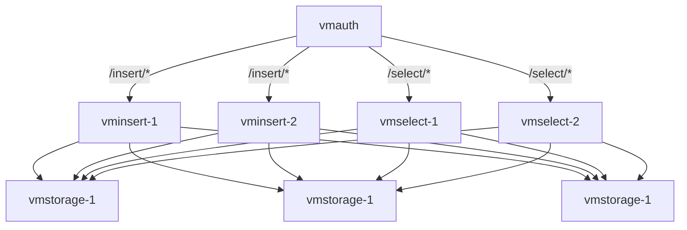

# ansible-playbooks

Ansible roles and playbooks for Victoria Metrics.

## How to install

Roles are published in ansible galaxy: https://galaxy.ansible.com/ui/namespaces/victoriametrics/

Install collection:

```shell
ansible-galaxy collection install victoriametrics.cluster
```

## Contents

Collection includes the following roles:

- [single](./roles/single) - installs and configures VictoriaMetrics single node
- [vmagent](./roles/vmagent) - installs and configures `vmagent`
- [vmalert](./roles/vmalert) - installs and configures `vmalert`
- [vmselect](./roles/vmselect) - installs and configures `vmselect`
- [vmstorage](./roles/vmstorage) - installs and configures `vmstorage`
- [vminsert](./roles/vminsert) - installs and configures `vminsert`
- [vmauth](./roles/vmauth) - installs and configures `vmauth`

See [cluster](playbooks/cluster.yml) and [single](playbooks/single.yml) playbooks for examples of how to use these
roles.

Deprecated roles:

- [docker](./roles/docker) - role for docker installation
- [load_balancer](./roles/load_balancer) - nginx setup for load balancing between select and insert nodes
- [cluster](./roles/cluster) - installs and configures VictoriaMetrics cluster running in docker

These roles are deprecated in favor of roles for each component. They are still available in the collection, but will be
removed in future releases.
Note that per-component roles are using binary releases of VictoriaMetrics, while cluster role is using docker images.

## Cluster deployment

Cluster deployment example is available in [playbooks/cluster.yml](./playbooks/cluster.yml).
The playbook deploys VictoriaMetrics cluster and vmauth to act as a load balancer and authentication proxy.
See [inventory](./inventory_example/cluster-inventory) for example of inventory file.

Here is a diagram of the cluster deployment:



It's also possible to use molecule scenario to create a local cluster for testing.
See [molecule](./playbooks/molecule/cluster) directory for details. The scenario uses docker as a driver and
sets up a container for each component. The scenario can be deployed by
using `make molecule-converge-cluster-integration` command.

# Development

In order to set up development environment, you need to have `docker`, `python` and `make` installed.
Run `make init-venv` to create virtual environment and install required packages for linting and testing
with [molecule](https://ansible.readthedocs.io/projects/molecule).

Please, note that [cluster](./roles/cluster) role is tested with `vagrant` and `libvirt` provider and
requires `vagrant` [to be installed](https://www.vagrantup.com/downloads).

Refer to [Makefile](./Makefile) for available commands for linting and molecule testing.
