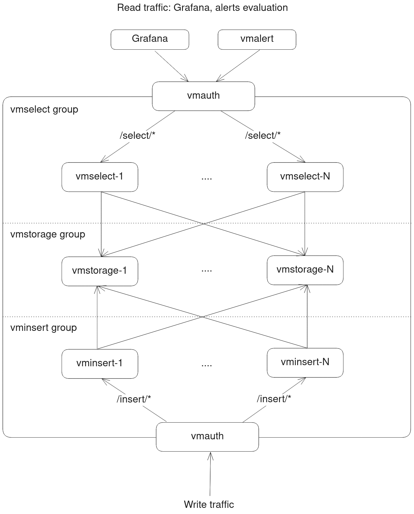

# ansible-playbooks

Ansible roles and playbooks for Victoria Metrics.

## Quick start

1. Install ansible binaries `ansible-galaxy` and `ansible-playbook`.

1. Install the collection:
    ```sh
    ansible-galaxy collection install victoriametrics.cluster
    ```

1. Create an inventory file `inventory.ini` describing your hosts. Adjust IP addresses as needed:
    ```ini
    [homelab]
      192.168.50.2
    ```

1. Create a playbook `deploy_vmsingle.yml` to deploy VictoriaMetrics single node:
    ```yaml
    - name: Deploy VictoriaMetrics
      hosts: homelab
      become: true
      collections:
        - victoriametrics.cluster

      roles:
        - role: vmsingle
          vars:
            # Check available variables and their defaults here:
            # https://github.com/VictoriaMetrics/ansible-playbooks/tree/master/roles/vmsingle
            victoriametrics_retention_period_months: "3"
    ```

1. Run the playbook. Address any errors that may arise:
    ```sh
    ansible-playbook -i inventory.ini  deploy_vmsingle.yml
    ```
   
1. Check that VictoriaMetrics is running by accessing `http://192.168.50.2:8428/vmui` in your browser.

You can deploy other playbooks in a similar way. See [Contents](#contents) section for available roles.

## Install collection

Roles are published to ansible galaxy: https://galaxy.ansible.com/ui/namespaces/victoriametrics/

Install collection:

```shell
ansible-galaxy collection install victoriametrics.cluster
```

## Contents

Collection includes the following roles:

- [vmsingle](./roles/vmsingle) - installs and configures [VictoriaMetrics single node](https://docs.victoriametrics.com/single-server-victoriametrics/)
- [vlagent](./roles/vlagent) - installs and configures [`vlagent`](https://docs.victoriametrics.com/vlagent/)
- [vmagent](./roles/vmagent) - installs and configures [`vmagent`](https://docs.victoriametrics.com/vmagent/)
- [vmalert](./roles/vmalert) - installs and configures [`vmalert`](https://docs.victoriametrics.com/vmalert/)
- [vmselect](./roles/vmselect) - installs and configures [`vmselect`](https://docs.victoriametrics.com/cluster-victoriametrics/)
- [vmstorage](./roles/vmstorage) - installs and configures [`vmstorage`](https://docs.victoriametrics.com/cluster-victoriametrics/)
- [vminsert](./roles/vminsert) - installs and configures [`vminsert`](https://docs.victoriametrics.com/cluster-victoriametrics/)
- [vmauth](./roles/vmauth) - installs and configures [`vmauth`](https://docs.victoriametrics.com/vmauth/)
- [vlsingle](./roles/vlsingle) - installs and configures [VictoriaLogs single node](https://docs.victoriametrics.com/victorialogs/)

See [cluster](playbooks/cluster.yml) and [vmsingle](playbooks/vmsingle.yml) playbooks for examples of how to use these
roles.

## Cluster deployment

Cluster deployment example is available in [playbooks/cluster.yml](./playbooks/cluster.yml).
The playbook deploys [VictoriaMetrics cluster](https://docs.victoriametrics.com/cluster-victoriametrics/) and [vmauth](https://docs.victoriametrics.com/vmauth/) to [act as a load balancer](https://docs.victoriametrics.com/vmauth/#load-balancer-for-victoriametrics-cluster) and authentication proxy.
See [inventory](./inventory_example/cluster-inventory) for example of inventory file.

Here is a diagram of the cluster deployment:


It's also possible to use molecule scenario to create a local cluster for testing.
See [molecule](./playbooks/molecule/cluster) directory for details. The scenario uses docker as a driver and
sets up a container for each component. The scenario can be deployed by
using `make molecule-converge-cluster-integration` command.

# Development

In order to set up development environment, you need to have `docker`, `python` and `make` installed.
Run `make init-venv` to create virtual environment and install required packages for linting and testing
with [molecule](https://ansible.readthedocs.io/projects/molecule).

The following commands are useful for development:
- `make lint` - runs ansible-lint on all roles and playbooks
- `make molecule-converge` - runs molecule converge for default scenario of all roles
- `make molecule-converge-integration` - runs molecule converge for integration scenario of all roles
- `make molecule-destroy` - destroys all molecule instances created during testing

Refer to [Makefile](./Makefile) for the full list of commands.
