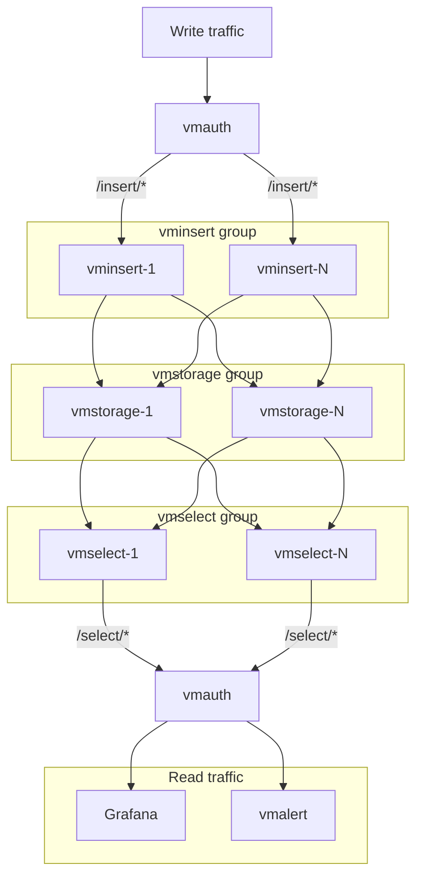

# VictoriaMetrics Cluster Deployment

Cluster deployment example is available in [playbooks/cluster.yml](../playbooks/cluster.yml).
The playbook deploys [VictoriaMetrics cluster](https://docs.victoriametrics.com/cluster-victoriametrics/) and [vmauth](https://docs.victoriametrics.com/vmauth/) to [act as a load balancer](https://docs.victoriametrics.com/vmauth/#load-balancer-for-victoriametrics-cluster) and authentication proxy.
See [inventory](../inventory_example/cluster-inventory) for example of inventory file.

Here is a diagram of the cluster deployment:

It's also possible to use molecule scenario to create a local cluster for testing.
See [molecule](../playbooks/molecule/cluster) directory for details. The scenario uses docker as a driver and
sets up a container for each component. The scenario can be deployed by
using `make molecule-converge-cluster-integration` command.
