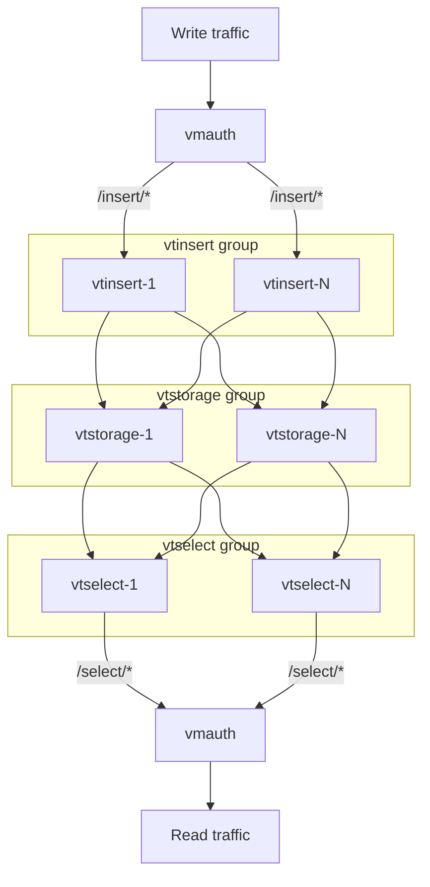

# VictoriaTraces Cluster Deployment

Cluster deployment example is available in [playbooks/vtcluster.yml](../playbooks/vtcluster.yml).
The playbook deploys [VictoriaTraces cluster](https://docs.victoriametrics.com/victoriatraces/cluster/) and [vmauth](https://docs.victoriametrics.com/victoriametrics/vmauth/) to act as a load balancer.
See [inventory](../inventory_example/vtcluster-inventory) for example of inventory file.

All three cluster components (vtstorage, vtinsert, vtselect) use the same `vtsingle` role since they share a single binary. The component role is determined by flags passed via `victoriatraces_service_args`:

- **vtstorage** — uses role defaults (no extra flags needed)
- **vtinsert** — sets `storageNode` and `select.disable: "true"`
- **vtselect** — sets `storageNode` and `insert.disable: "true"`

Here is a diagram of the cluster deployment:

It's also possible to use molecule scenario to create a local cluster for testing.
See [molecule](../playbooks/molecule/vtcluster) directory for details. The scenario uses docker as a driver and
sets up a container for each component. The scenario can be deployed by
using `make molecule-converge-vtcluster-integration` command.
